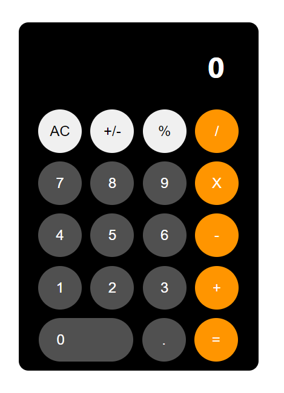

# Calculadora com REACT

projeto feito na aula do <a href="https://youtu.be/T7Cxu10Kln4">Leo</a>

<a href="https://github.com/Leoujo/react-projects/tree/master/calculator">Repositório</a> oficial do Leo

